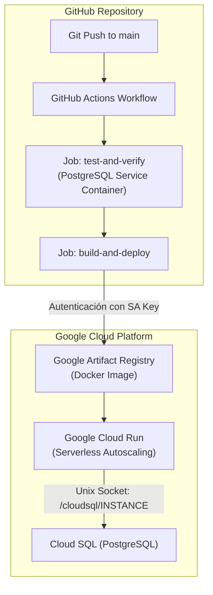

# Guía de Despliegue en Google Cloud Platform (CI/CD)

Esta guía describe el funcionamiento del pipeline automatizado de integración y entrega continua (CI/CD) definido en [`.github/workflows/deploy.yml`](file:///home/carlos/Escritorio/tareas_2026/2do%20semestre/semi/fase%202/app/.github/workflows/deploy.yml), diseñado bajo el perfil **devops-gcp-automation**.

---

## 🏗️ Arquitectura de Despliegue



---

## 🔐 1. Configuración de Roles y Service Account en GCP

La cuenta de servicio (Service Account) utilizada por GitHub Actions requiere los siguientes roles mínimos de IAM en el proyecto de Google Cloud:

```bash
# Variables del proyecto
export PROJECT_ID="tu-proyecto-id"
export SA_NAME="github-actions-deployer"
export SA_EMAIL="${SA_NAME}@${PROJECT_ID}.iam.gserviceaccount.com"

# 1. Crear la cuenta de servicio
gcloud iam service-accounts create $SA_NAME \
  --description="Service account para CI/CD desde GitHub Actions" \
  --display-name="GitHub Actions Deployer" \
  --project=$PROJECT_ID

# 2. Asignar rol de publicación en Artifact Registry
gcloud projects add-iam-policy-binding $PROJECT_ID \
  --member="serviceAccount:$SA_EMAIL" \
  --role="roles/artifactregistry.writer"

# 3. Asignar rol de administración de Cloud Run
gcloud projects add-iam-policy-binding $PROJECT_ID \
  --member="serviceAccount:$SA_EMAIL" \
  --role="roles/run.admin"

# 4. Asignar rol para que Cloud Run pueda actuar con la identidad de servicio
gcloud projects add-iam-policy-binding $PROJECT_ID \
  --member="serviceAccount:$SA_EMAIL" \
  --role="roles/iam.serviceAccountUser"

# 5. Asignar rol de cliente de Cloud SQL
gcloud projects add-iam-policy-binding $PROJECT_ID \
  --member="serviceAccount:$SA_EMAIL" \
  --role="roles/cloudsql.client"

# 6. Generar la clave privada en formato JSON para GitHub Secrets
gcloud iam service-accounts keys create sa-key.json \
  --iam-account=$SA_EMAIL \
  --project=$PROJECT_ID
```

---

## 📦 2. Crear Repositorio en Google Artifact Registry

```bash
gcloud artifacts repositories create libreria-repo \
  --repository-format=docker \
  --location=us-central1 \
  --description="Imágenes Docker para Librería Oskar" \
  --project=$PROJECT_ID
```

---

## 🔑 3. Configuración de Secretos en GitHub (Repository Secrets)

Ve a tu repositorio en GitHub: **Settings -> Secrets and variables -> Actions -> New repository secret** y registra los siguientes secretos:

| Nombre del Secreto | Descripción | Ejemplo / Formato |
|---|---|---|
| `GCP_PROJECT_ID` | Identificador del proyecto en Google Cloud | `mi-proyecto-gcp-123456` |
| `GCP_SA_KEY` | Contenido completo del archivo `sa-key.json` | `{"type": "service_account", ...}` |
| `CLOUD_SQL_CONNECTION_NAME` | Nombre de conexión de Cloud SQL | `mi-proyecto:us-central1:libreria-db` |
| `DB_USER` | Usuario de base de datos en Cloud SQL | `postgres` o `libreria_user` |
| `DB_PASSWORD` | Contraseña del usuario de base de datos | `PasswordSeguro123!` |
| `DB_NAME` | Nombre de la base de datos | `libreria_oskar` |
| `GOOGLE_BOOKS_API_KEY` | (Opcional) Clave de API de Google Books | `AIzaSy...` |

### Variables de Configuración Opcionales (Repository Variables):
| Variable | Descripción | Valor por Defecto |
|---|---|---|
| `GCP_REGION` | Región para Cloud Run | `us-central1` |
| `GAR_LOCATION` | Ubicación de Artifact Registry | `us-central1` |
| `GAR_REPOSITORY` | Nombre del repositorio de imágenes | `libreria-repo` |
| `SERVICE_NAME` | Nombre del servicio en Cloud Run | `libreria-backend-api` |

---

## 🧪 4. Ejecución del Pipeline

Al hacer `git push origin main`:
1. **Fase de Pruebas (CI)**:
   - Levanta un contenedor de PostgreSQL con `database/schema.sql`.
   - Ejecuta las 17 pruebas unitarias, de integración y E2E de la API.
2. **Fase de Despliegue (CD)**:
   - Compila la imagen multi-etapa (`backend/Dockerfile`).
   - Sube la imagen etiquetada con el commit hash y `:latest` a Artifact Registry.
   - Despliega en Cloud Run inyectando la conexión a Cloud SQL vía socket UNIX (`/cloudsql/INSTANCE_CONNECTION_NAME`) y variables de entorno de producción.
